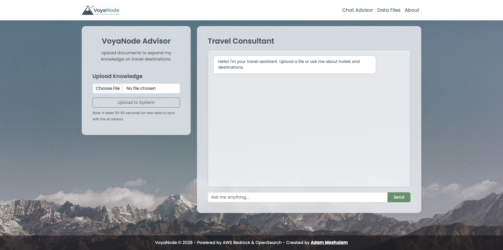
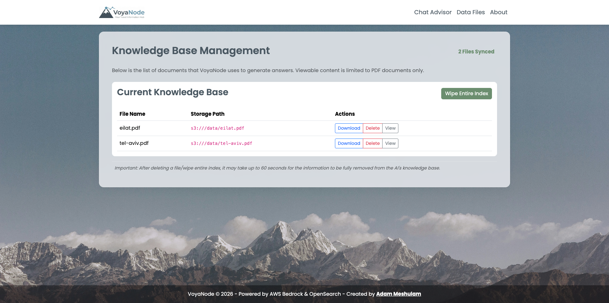
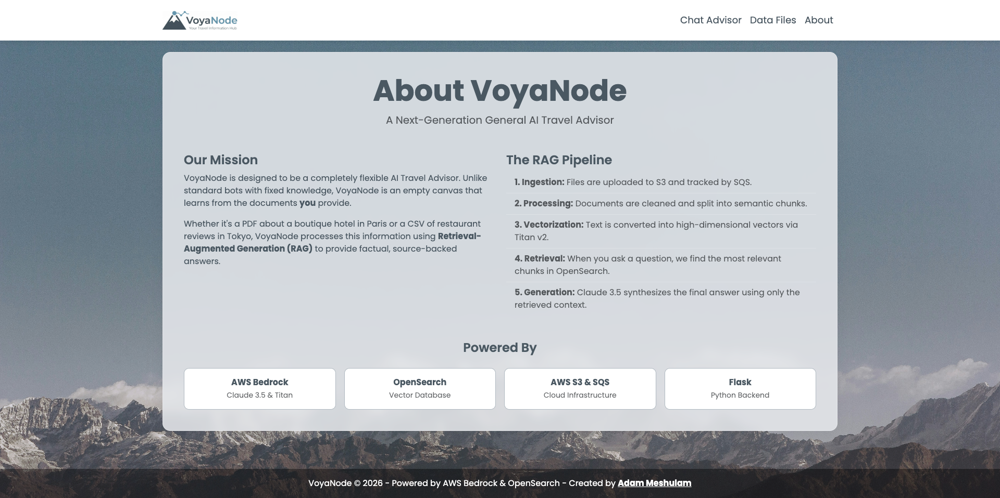

# VoyaNode 🌍
## AI-Powered Agentic RAG Travel Advisor

"VoyaNode" is a state-of-the-art Retrieval-Augmented Generation (RAG) system designed to transform travel documents (PDFs) into an interactive, intelligent travel assistant. Built on AWS Serverless architecture, it leverages high-performance vector search and generative AI to provide factual, context-aware travel advice.

---

## 🚀 Key Features

- **Agentic RAG**: Uses Anthropic Claude 3.5 Haiku to reason through travel documents and provide precise, context-aware answers.
- **Asynchronous Processing**: A dedicated SQS Worker handles document chunking and vector embedding in the background.
- **Vector Search**: Powered by Amazon OpenSearch Serverless (AOSS) with k-NN indexing.
- **Production Ready**: Includes systemd service configurations and Docker support for seamless deployment on EC2.
- **Live Monitoring**: Real-time indexing status and chunk-count tracking in the data management dashboard.

---

## 🏗️ System Architecture

The system follows a modern RAG pipeline:

1. **Ingestion**: PDF files are uploaded to Amazon S3.  
2. **Messaging**: S3 triggers an event to Amazon SQS.  
3. **Processing**: A Python Worker retrieves the file, performs intelligent chunking, and generates 1024-dimension embeddings using Amazon Titan v2.  
4. **Storage**: Vectors and metadata are stored in an OpenSearch Serverless k-NN index.  
5. **Retrieval**: When a user asks a question, the system finds relevant chunks and uses Claude 3.5 to synthesize a response.  

---

## 🛠️ Tech Stack

### Frontend & UI
- Flask (Python Web Framework)
- HTML5 & CSS3 (Modern Glassmorphism Design)
- JavaScript (Asynchronous AJAX requests)

### Backend & Processing
- Python 3.12
- Gunicorn (WSGI HTTP Server)
- Nginx (Reverse Proxy & Static File Hosting)

### AI / ML (AWS Bedrock)
- **Claude 3.5 Haiku:** Reasoning and response synthesis.
- **Titan Embeddings v2:** High-performance 1024-dim vector generation.

### Database & Orchestration
- **Amazon OpenSearch Serverless:** Vector engine for k-NN retrieval.
- **Amazon S3:** Scalable object storage for PDF documents.
- **Amazon SQS:** Message queuing for decoupled, async processing.
- **Docker & Docker Compose:** Container orchestration.

---

## 📂 Project Structure

```plaintext
VoyaNode/
├── app.py              # Main Flask API: Manages UI, Chat, and RAG retrieval logic.
├── worker.py           # Background Processor: Listens to SQS and handles PDF indexing.
├── config.py           # Configuration Management: Loads and validates .env variables.
├── requirements.txt    # Python Dependencies.
├── Dockerfile          # Containerization for EC2 deployment.
├── README.md           # Project Documentation.
│
├── .env.example        # Template for secrets and environment variables.
├── .gitignore          # Git exclusion file (prevents uploading .env and sensitive keys).
├── .dockerignore       # Docker exclusion file (prevents unnecessary files in the image).
│
├── systemd/            # Linux Service Configurations:
│   ├── rag-api.service     # Service to ensure the API runs 24/7 via Gunicorn.
│   └── rag-worker.service  # Service to keep the asynchronous processor active.
│
├── scripts/            # Automation & Maintenance:
│   ├── create_infra.py     # IaC Script: Automatically creates S3, SQS, and AOSS collections.
│   ├── create_index.py     # Database Init: Sets up the k-NN vector index.
│   ├── upload_data.py      # Data Ingestion: Batch uploads local PDFs to S3.
│   └── smoke_test.py       # Health Check: Validates AWS connections before runtime.
│
├── utils/              # Core Logic (The "Engine"):
│   ├── s3_utils.py         # Storage Management: Upload/Download/Delete logic for S3.
│   ├── chunking.py         # Document Processing: PDF cleaning and semantic chunking.
│   ├── opensearch_utils.py # Vector DB Engine: k-NN search and indexing management.
│   └── bedrock_utils.py    # GenAI Interface: Embedding generation and Claude 3.5 chat.
│
├── templates/          # Frontend Components (HTML):
│   ├── base.html           # Site skeleton (Header/Footer).
│   ├── index.html          # Chat interface: Interaction with the Travel Advisor.
│   ├── data.html           # Data Dashboard: File status, indexing logs, and Wipe functionality.
│   └── about.html          # Project info: Explaining RAG and System Architecture.
│
├── static/             # Styles & Client-side Logic:
│   ├── css/main.css        # Visual styling: Modern Glassmorphism theme.
│   ├── js/main.js          # Browser logic: Real-time chat updates and AJAX calls.
│   └── images/             # UI Assets: Logos and background graphics.
│
└── data/               # Local Storage:
    ├── raw/                # Source PDFs for initial ingestion.
    └── processed/          # Temporary folder for files during processing.
```

---

## ⚙️ Setup & Installation
Follow these steps to deploy "VoyaNode" on your local machine or an AWS EC2 instance.

### 1. Prerequisites
* **AWS Account:** Access to Amazon Bedrock (Claude 3.5 Haiku & Titan v2 models must be enabled).
* **Docker & Docker Compose:** Installed and running.
* **Python 3.12+:** Required for running infrastructure setup scripts.
* **AWS CLI:** Configured with appropriate permissions (S3, SQS, AOSS, Bedrock).

### 2. Clone & Environment Configuration
```bash
# Clone the repository
git clone https://github.com/AdamMes/voyanode.git
cd VoyaNode

# Create environment file from template
cp .env.example .env
# Important: Open .env and fill in your AWS_REGION, S3_BUCKET, SQS_URL, and OS_HOST.
```

### 3. Infrastructure Automation
Before running the application, use the provided automation scripts to provision your AWS environment:

1. **Provision Resources:** Create the S3 bucket, SQS queue, and OpenSearch Collection.
    ```bash
    python scripts/create_infra.py
    ```
   ***Note: Wait until the OpenSearch Collection status is 'Active' in the AWS Console.***
2. **Initialize Vector Index:** Create the ```voyanode-index``` with the required k-NN settings.
    ```bash
    python scripts/create_index.py
    ```
### 4. Run with Docker
The entire stack (API, Worker, and Nginx) is containerized for easy deployment. Run the following command to start the system:
```bash
# Build and start containers in detached mode
docker compose up -d --build
```
The UI will be accessible at ```http://localhost``` (or your EC2 Public IP).

---

## 🌐 Production Deployment (EC2)
For a robust production environment on AWS EC2, follow these additional optimizations:

### 1. Memory Optimization (Swap File)
If using a ```t3.medium``` instance, it is highly recommended to enable a Swap file to prevent OOM (Out Of Memory) crashes during PDF processing:
```bash
sudo fallocate -l 2G /swapfile
sudo chmod 600 /swapfile
sudo mkswap /swapfile
sudo swapon /swapfile
echo '/swapfile none swap sw 0 0' | sudo tee -a /etc/fstab
```

### 2. Systemd Service Configuration
To ensure the services auto-restart on failure or reboot (when not using Docker), use the provided service files:
```bash
sudo cp systemd/*.service /etc/systemd/system/
sudo systemctl daemon-reload
sudo systemctl enable --now rag-api.service rag-worker.service
```

## 🧠 Technical Challenges & Optimizations
### 1. Memory Management on t3.medium
The Python Worker occasionally faced **OOM (Out Of Memory)** crashes during intensive PDF embedding tasks.
- **Optimization:** Implemented a **2GB Linux Swap file** to expand virtual memory, ensuring the Worker remains stable during high-load processing.

### 2. OpenSearch Serverless Request Timeouts
Initial requests to OpenSearch Serverless occasionally exceeded default 10-second limits.
- **Optimization:** Configured the OpenSearch Python client with a 30-second timeout to handle serverless scaling delays.

### 3. Multi-Platform Deployment
Resolved compatibility issues between development (Apple Silicon M-series) and production (Intel x86_64 EC2).
- **Optimization:** Used a multi-platform build strategy (--platform linux/amd64) for Docker images to ensure binary compatibility.

---

## 📜 License
This project is licensed under the MIT License.

---

## 👨‍🏫 Academic Information
- **Project Name:** VoyaNode Travel Advisor
- **Course:** AI Engineer Certification
- **Developer:** Adam Meshulam

---

# 📸 Screenshots
### Chat Advisor page (home)


### Data files page


### About page


---
